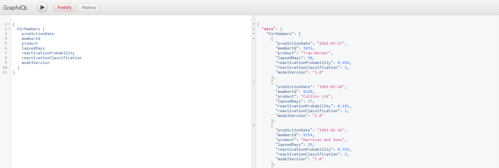
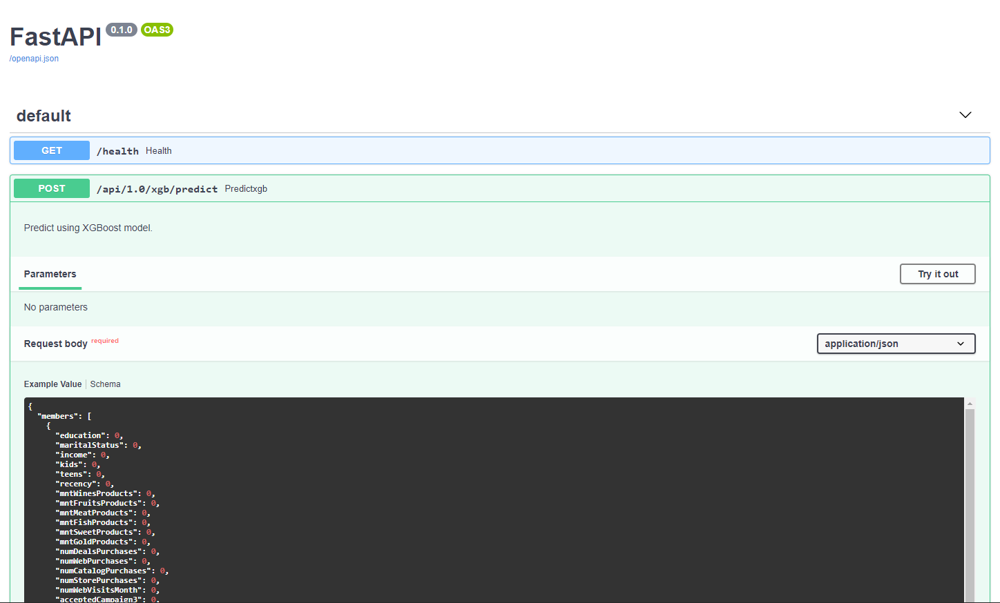

# The Fastest API in the Pythonic World

- [The Fastest API in the Pythonic World](#the-fastest-api-in-the-pythonic-world)
  - [Resources](#resources)
  - [Usage](#usage)
  - [Examples](#examples)
    - [GraphQL request examples](#graphql-request-examples)
    - [ML Model request examples](#ml-model-request-examples)

## Resources

- [Slides](docs/The_Fastest_API_in_the_Pythonic_World.pptx)

## Usage

To get started right away you need:

- Create virtual environment or conda environment:

```shell
make conda-env
```

```shell
make py-env
```

- Run DB:

```shell
make run-postgres
```

- Populate DB:

```shell
make populate-db
```

- Run examples:

```shell
make graphql
```

```shell
python src/graphql_example.py
```

```shell
make ml
```

```shell
python src/ml_model_example.py
```

## Examples

- [WebSockets](src/websockets_example.py)
- [GraphQL](src/graphql_example.py)
- [ML Model](src/ml_model_example.py)

### GraphQL request examples

- Request one member:

```shell
curl --location --request POST 'http://localhost:8030' \
--header 'Content-Type: application/json' \
--data-raw '{"query":"{\r\n  member(memberId: 3031) {\r\n    predictionDate\r\n    memberId\r\n    product\r\n    lapsedDays\r\n    reactivationProbability\r\n    reactivationClassification\r\n    modelVersion\r\n  }\r\n}","variables":{}}'
```

```
{
  member(memberId: 3031) {
    predictionDate
    memberId
    product
    lapsedDays
    reactivationProbability
    reactivationClassification
    modelVersion
  }
}
```

- Request members that are highly like to reactivate:

```shell
curl --location --request POST 'http://localhost:8030' \
--header 'Content-Type: application/json' \
--data-raw '{"query":"{\r\n\thlrMembers {\r\n\t  memberId\r\n\t  product\r\n\t  reactivationProbability\r\n\t  reactivationClassification\r\n\t  modelVersion\r\n\t}\r\n}","variables":{}}'
```

```
{
	hlrMembers {
	  predictionDate
	  memberId
	  product
	  lapsedDays
	  reactivationProbability
	  reactivationClassification
	  modelVersion
	}
}
```



### ML Model request examples

- SwaggerUI

```shell
http://localhost:8020/docs
```



- OpenAPI

```http request
http://localhost:8020/openapi.json
```

```shell
curl --location --request GET 'http://localhost:8020/openapi.json'
```

- Prediction example:

```shell
curl --location --request POST 'http://localhost:8020/api/1.0/xgb/predict' \
--data-raw '{
    "members": [
        {
            "education": 2.0,
            "maritalStatus": 4.0,
            "income": 58138.0,
            "kids": 0.0,
            "teens": 0.0,
            "recency": 58.0,
            "mntWinesProducts": 635.0,
            "mntFruitsProducts": 88.0,
            "mntMeatProducts": 546.0,
            "mntFishProducts": 172.0,
            "mntSweetProducts": 88.0,
            "mntGoldProducts": 88.0,
            "numDealsPurchases": 3.0,
            "numWebPurchases": 8.0,
            "numCatalogPurchases": 10.0,
            "numStorePurchases": 4.0,
            "numWebVisitsMonth": 7.0,
            "acceptedCampaign3": 0.0,
            "acceptedCampaign4": 0.0,
            "acceptedCampaign5": 0.0,
            "acceptedCampaign1": 0.0,
            "acceptedCampaign2": 0.0,
            "complain": 0.0,
            "age": 58.0,
            "maturity": 849.0
        }
    ]
}'
```

- Invalid prediction:

```shell
curl --location --request POST 'http://localhost:8020/api/1.0/xgb/predict' \
--data-raw '{
    "members": [
        {
            "education": 2.0,
            "maritalStatus": 4.0,
            "income": 58138.0,
            "kids": 0.0,
            "teens": 0.0,
            "recency": 58.0,
            "mntWinesProducts": 635.0,
            "mntFruitsProducts": 88.0,
            "mntMeatProducts": 546.0,
            "mntFishProducts": 172.0,
            "mntSweetProducts": 88.0,
            "mntGoldProducts": 88.0,
            "numDealsPurchases": 3.0,
            "acceptedCampaign3": 0.0,
            "acceptedCampaign4": 0.0,
            "acceptedCampaign5": 0.0,
            "acceptedCampaign1": 0.0,
            "acceptedCampaign2": 0.0,
            "complain": 0.0,
            "age": 58.0,
            "maturity": 849.0
        }
    ]
}'
```